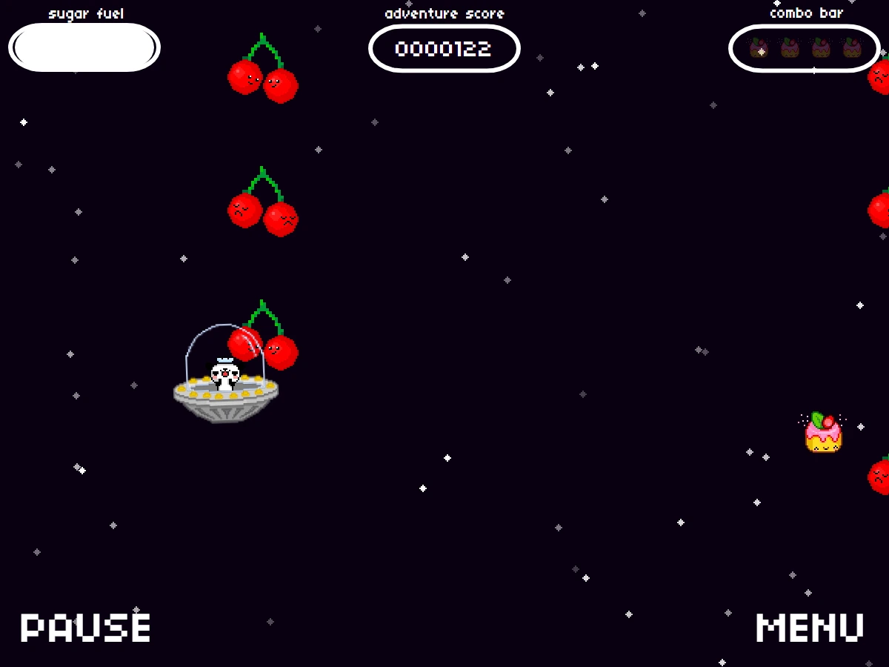
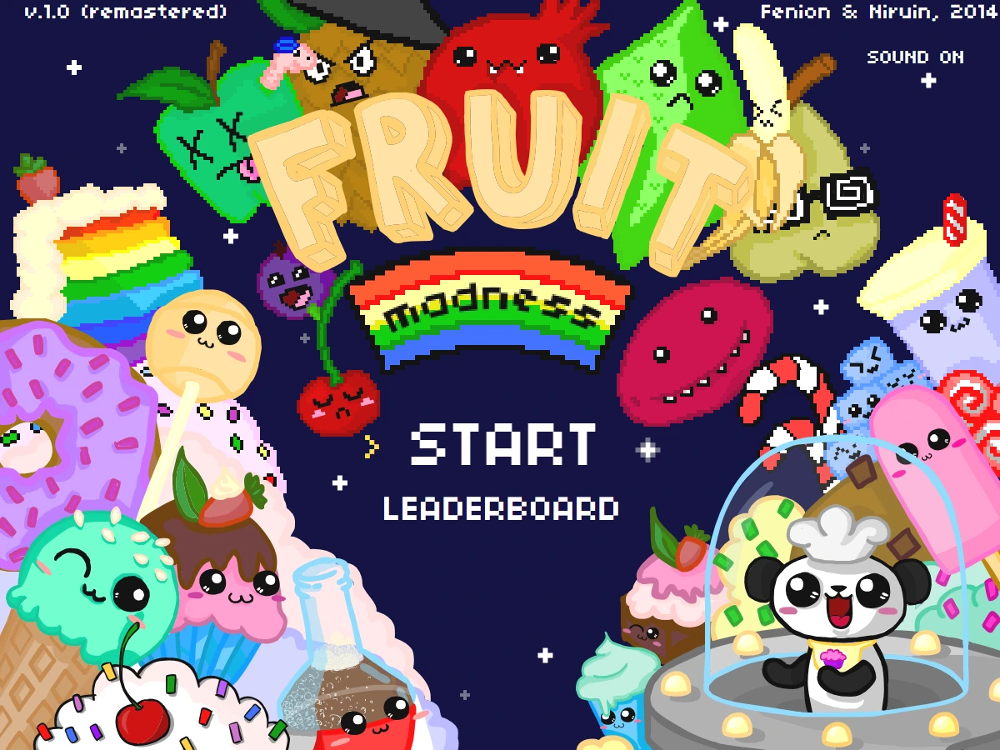

# Fruit Madness Remastered

*A panda in a UFO, an endless swarm of very angry fruit, and one muffin between you and an empty tank.*

**[▶ Play now](https://leinstay.github.io/fruit-madness-remastered/)** — no install, no plugins, runs in any modern browser.



 

## About

Fruit Madness is an endless arcade dodge-'em-up. You fly a small flying saucer across a 600×450 pixel
starfield while waves of fruit charge in from every side; your only job is to slip through the gaps and
keep collecting the muffins that refuel you. Pixel art, chiptune and a fixed 60 Hz step — the whole thing
is built in the spirit of NES-era arcade games.

The original *Fruit Madness* was a Flash game we made in 2013
([leinstay/fruitmadness](https://github.com/leinstay/fruitmadness), ActionScript 3). Flash is gone, so this
is a from-scratch HTML5 remaster: the same physics constants, the same artwork and the same music, rewritten
in plain JavaScript with no plugin, no build step and no dependencies. The playfield is drawn from the
original vector artwork at whatever resolution your display really has, and every caption is set in the
game's own pixel font, so the game stays sharp in any window.



## How to play

- **Move** — `W` `A` `S` `D` or the arrow keys. On a phone or tablet, touch anywhere on the field: a floating
  joystick appears under your thumb and steers exactly like the keys do.
- **Pause** — `P` or `Esc`, or the on-screen `PAUSE` button.
- **Survive.** One touch of any fruit ends the run. The score ticks up on every frame you stay alive, so the
  longer you last the higher it climbs.
- **Fuel.** The tank holds 100 units and drains by 0.05 per frame — about 33 seconds of flight. Every muffin
  gives back 10. Run dry and the saucer does not die, it crawls: top speed drops from 6 to 0.5 px per frame
  and you are a sitting duck.
- **Combo.** Every muffin lights one of the four cells of the combo bar, and every lit cell raises the score
  multiplier (up to ×5). A muffin is worth 100 points times the multiplier it has just raised — 200 for the
  first one, 500 on a full bar. The bar does not last: cells burn down one at a time from the right, four
  seconds each, so keep the muffins coming. Missing one costs you nothing but the fuel.
- **DANGER.** Attacks come in cycles: 15 seconds of one attack, then a 5-second warning that flashes on the
  edge the next wave will come from. Waves come faster and faster, and later on two perpendicular sides can
  attack at once.
- **Leaderboard.** After a crash, enter a nickname of 3–6 latin letters or digits to put your score on the
  online top-10 table.

## Features

- The original 2013 artwork and music, drawn from the vectors at your display's own resolution.
- Attack formations that are always dodgeable — never a wall you could not have slipped through.
- Eight attack directions and double-sided attacks that come in from two edges at once.
- Fuel, a four-cell combo multiplier that decays over time and a seven-digit score.
- Online top-10 leaderboard.
- Keyboard on desktop, floating touch joystick on mobile.
- Zero dependencies and no build step; the game also runs fine if the audio fails to load.

## Run locally

```bash
git clone https://github.com/leinstay/fruit-madness-remastered.git
cd fruit-madness-remastered
python -m http.server 8080
```

Then open <http://localhost:8080>. A server is required because the game is made of ES modules, which
browsers refuse to load over `file://`.

### Tests

```bash
node --test tests/          # 241 tests, about two minutes
```

The long survivability proof is opt-in, because it is slow:

```bash
SOLVER_SEEDS=100 SOLVER_FRAMES=3600 node --test tests/solvability.test.js
```

`SOLVER_SEEDS` is how many worlds to check (12 by default) and `SOLVER_FRAMES` how many frames of each
(3600 = one minute of play).

## Tech

Vanilla JavaScript ES modules, Canvas 2D at a fixed 60 Hz step, no framework, no bundler, no build step.
Every drawing in the game is the original 2013 artwork as SVG, rasterised at the resolution the display
really has and re-done when that changes, and every caption is set at runtime in the game's own pixel font.
The leaderboard is a single Firestore collection, read and written straight from the browser with the
Firebase web SDK loaded from a CDN.

The interesting part is the fairness guarantee. Enemy waves are not random noise: they are laid out on a
grid of lanes by a generator that always leaves a gap, and every random decision goes through a seeded
generator, so a world is fully reproducible from its seed. That claim is then checked by a simulator test:
it replays recorded worlds against a bot that uses the *real* player physics and the *real* hit test, and
searches for a path that survives every frame. Adding a new attack pattern means nothing until that search
still finds a way through for every seed.

### Run your own leaderboard

The Firebase web config in `js/config.js` is public by design — it ships inside every Firebase web app and
grants nothing on its own. All of the security lives in `firestore.rules`, which pins the exact shape of a
score document and forbids updates and deletes. If you fork this game, create your own Firebase project,
publish those rules in its console and replace the config block with yours.

## Project structure

```
index.html          the page: a canvas and the nickname field
css/                the page shell and the mobile layout
js/
  main.js           entry point and scene switching
  config.js         constants of the original, tuned in 2013
  core/             loop, input, audio, asset loading, seeded rng, sprite animation
  game/             player, enemies, formations, director, collisions, combo (pure logic)
  scenes/           menu, game, game over, leaderboard
  services/         the Firestore leaderboard client
assets/             the vector artwork, the pixel font, music and sound effects
tests/              node --test suites, including the survivability simulator
tools/              make-svg-sprites.mjs prepares the gameplay drawings, make-title.py
                    builds the title screen, and xfl2svg.py converts drawings from the
                    original 2013 Flash source document to SVG
firestore.rules     the leaderboard security rules
```

## Credits

Game, art and music by **Niruin & Fenion** — the Flash original in 2013–2014, this HTML5 remaster in 2026.

The pixel font is **04b03** by Yuji Oshimoto (04.jp.org), a freeware font.

## License

[MIT](LICENSE).
